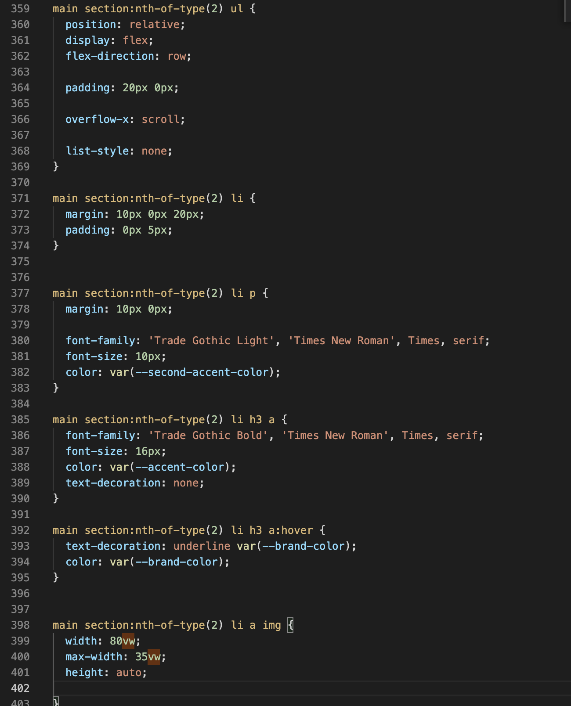

# Procesverslag
Markdown is een simpele manier om HTML te schrijven.  
Markdown cheat cheet: [Hulp bij het schrijven van Markdown](https://github.com/adam-p/markdown-here/wiki/Markdown-Cheatsheet).

Nb. De standaardstructuur en de spartaanse opmaak van de README.md zijn helemaal prima. Het gaat om de inhoud van je procesverslag. Besteedt de tijd voor pracht en praal aan je website.

Nb. Door *open* toe te voegen aan een *details* element kun je deze standaard open zetten. Fijn om dat steeds voor de relevante stuk(ken) te doen.

## Jij

uitwerken voor kick-off werkgroep

### Auteur:
Anneke Steller

#### Je startniveau:
Rood

#### Je focus:
Ik ga mij focussen op responsive design. 
 

## Je website

uitwerken voor kick-off werkgroep

### Je opdracht:
https://www.bathandbodyworks.com

#### Screenshot(s) van de eerste pagina (small screen): 
hier de naam van de pagina  

#### Screenshot(s) van de tweede pagina (small screen):
hier de naam van de pagina  

 

## Breakdownschets (week 1)

uitwerken na afloop 2e werkgroep

### de hele pagina: 

### dynamisch deel (bijv menu): 

## Voortgang 1 (week 2)

uitwerken voor 1e voortgang

### Stand van zaken
Ik loop momenteel wat achter dan de rest van mijn klasgenoten. Ik heb nu alle html van de eerste pagina er ingezet dus ik kan nu beginnen met het stylen van de pagina. 

### Agenda voor meeting
samen met je groepje opstellen

| Anneke         | Max en Zoe         | Aris         | Fleur      
| ---            | ---                | ---          | ---            
| achterstand    | hebben geen        | Vragen over  | Had geen vragen            
| vermelden      | vragen             | margin       |  
| ...            | ...                | ...          | ...              

### Verslag van meeting
- een keer goed voor zitten om achterstand bij te werken
- vragen stellen waarbij dat nodig is 

## Voortgang 2 (week 3)

uitwerken voor 2e voortgang

### Stand van zaken
Afgelopen week heb ik veel uren in mijn code gestopt en heb ik mijn eerste pagina kunnen afronden. 

Ik had op een gegeven moment wel wat moeite met de items in de scrollbar maar dat heb ik uiteindelijk kunnen fixen. 

### Agenda voor meeting
samen met je groepje opstellen

| Larissa        | Yeliz              | Anneke       | student 4        |
| ---            | ---                | ---          | ---              |
|Logo veranderen | vragen welke       | Heb geen     | en dan ik dat    |
| in darkmode    | beter is om        | vragen       | dit wil ik zeker |
| ...            | te maken           | ...          | ...              |

### Verslag van meeting
hier na afloop snel de uitkomsten van de meeting vastleggen

- Larissa heeft haar logo kunnen veranderen 
- Yeliz heeft nog steeds geen keuze kunnen maken welke pagina ze wilt gaan maken 
- nog een punt
- ...

## Toegankelijkheidstest (week 4)

uitwerken na test in 8e voortgang

### Bevindingen
Lijst met je bevindingen die in de test naar voren kwamen:

#### Screen reader
Verschillende alt tekstjes van afbeeldingen waren vaag of niet duidelijk. 
Verder las de screenreader niet de labels van het formulier voor.

Alt teksten veranderen naar een wat duidelijkere omschrijving en het label aan de input koppelen. 

#### Bril met 1 gaatje (slechtziend) . 

Met deze bril gaf mijn testpersoon aan dat kleine tekstjes lastig te lezen zijn. Met de focus state is wel goed te volgen waar je je beviend op de pagina. Verder mocht de "in winkelwagen" button op de tweede pagina wat groter.

Vooral alle teksten wat vergroten zodat het makkelijker te lezen is. 

#### Low contrast bril. 
Kleinere teskten waren lastig om te lezen. Verder was alles redelijk leesbaar. 

De font-size niet te klein maken. Vooral niet als er met dunne letters wordt gewerkt. 

#### Spasme/parkinson simulatie. 

Mijn testpersoon kon nog redelijk de website gebruiken. Hij maakte vooral gebruik van de tab toets omdat je toch best snel op random dingen klikt door het apparaat. 

Goed kijken of de focus state goed duidelijk is. 

## Voortgang 3 (week 4)

uitwerken voor 3e voortgang

### Stand van zaken
De laatste week heb ik mijn tweede pagina kunnen afmaken. Ik had wel wat moeite om mijn hamburger menu werkend te maken. Maar dat heb ik met de student-assistent kunnen fixen in de les. 

### Agenda voor meeting
samen met je groepje opstellen

Anneke: of er handige trukjes zijn om je css te cleanen 
Yeliz: vragen over wat precies valt onder DOM manipulatie\
Larissa: footer van tweede pagina is versprongen

### Verslag van meeting
hier na afloop snel de uitkomsten van de meeting vastleggen

- kijken voor extensions 
- extension van Sam gebruiken om mooi comments te kunnen plaatsen
- de slides van Sanne terug kijken over een schone css 

## Eindgesprek (week 5)

uitwerken voor eindgesprek

### Stand van zaken
Waar ik eigenlijk vooral moeite mee heb gehad is de tijd. Ik heb graag veel meer aan mijn site willen doen maar door de tijd kan dat jammer genoeg niet meer. Daarnaast heb ik vooral wel moeite gehad met javascript. Het lukte niet altijd om de juiste elementen aan te spreken. 

### Screenshot(s)

## Bronnenlijst

continu bijhouden terwijl je werkt

1. https://bathandbodyworks.nl/nl/
2. https://www.youtube.com/watch?v=t4LXx2PW1yA  (bron van het geluidje wat ik heb)
3. https://www.geeksforgeeks.org/how-to-insert-video-in-web-page-and-play-it-using-html/
4. https://www.youtube.com/watch?v=ZYV6dYtz4HA

